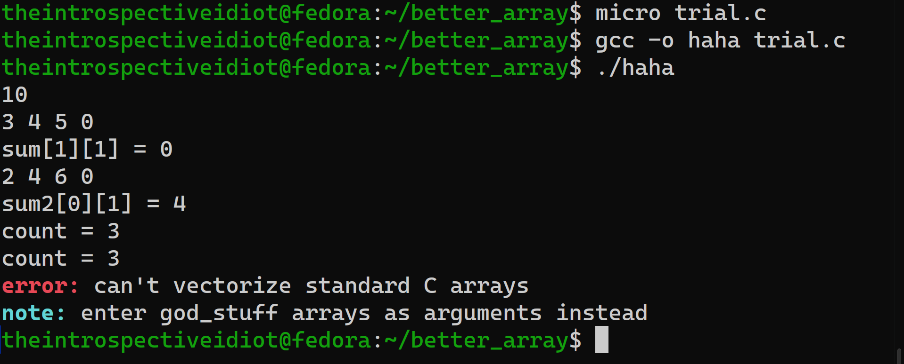

## better_array

Arrays in C never really felt boring, but... always less interesting.

Like, I can't decide the dimensions of an integer array at run time. Thats so uncool!!

So, I tried to implement a system similar to how `numpy` implements arrays. Its `shape` can be anything!

And numpy is fast because its implemented in C!! (Besides the optimizations they have applied to make it faster and the vectorization they use which makes it so cool!!)

The main idea behind this is if you wanna use a 2D or a higher dimensional array, you don't really need a 2D array (like `int A[1][2]`), instead you can have a 1D array and some way to traverse through it, you can do all the stuff you were able to do with 2D or higher arrays in a much cooler way!

## Metadata and Data

We need some sort of metadata (which stores stuff like `dimension`, how many `rows`, `coulumns`, the `height`, etc.).

I saw this sort of implementation [here](https://youtu.be/gtk3RZHwJUA) and that has heavily inspired this project. (Do check it out, it's really nice.)

The metadata we store is like this: 

```c
typedef struct {
	int *traverse;   //The shape of the array basically
	int *strides;    //The strides, which help in accessing data from each row and column
	int dim;         //The dimension of the array
	int count;       //How many elements have been filled in
	int total;       //How many elements can be filled (from the shape)
	int capacity;    //How many elements can be stored (from the memory stuff)
	long make_sure;  //To make sure that the integer pointer we got as argument is initialised by init()
	                 //helps in not corrupting memory when we try to vectorize it...
} god_stuff;
```

Now, this goes right before our array. How? Watch it [here](https://youtu.be/gtk3RZHwJUA) or continue reading.

What we essentially do is store the `array` with its `metadata` like this:

```c
[metadata][array]
^
```

(`metadata` is of type `god_stuff` and `array` is of type `int` here)

And `metadata + 1` takes us to the `array`:

```c
[metadata][array]
          ^
```

This way, we can go from the array to its metadata to know about it, and move through it like we know everything about it (even though we do).

We initialize our array like this:

```c
int *init(int dim,int *shape) {																				
	god_stuff *headr = malloc(sizeof(god_stuff) + (sizeof(int)*CAPACITY));  
	headr->make_sure = 28602529;             //Some key to ensure that the operation we are doing is on our array and not just some garbage in the memory
	headr->count = 0;	
	headr->dim = dim;	
	headr->total = 1;														
	headr->traverse = malloc(sizeof(int)*headr->dim);	
	headr->strides = malloc(sizeof(int)*headr->dim);	
	init_to_num(headr->strides,headr->dim,1);	
	headr->capacity = CAPACITY;	
	//printf("shape >> ");							
	for (int i=0;i<headr->dim;i++) {			
		//scanf("%d",&headr->traverse[i]);	
		//getchar();
		headr->traverse[i] = shape[i];										
		headr->total *= headr->traverse[i];			
	}			
																
	for (int i=0;i<headr->dim;i++) {								
		for(int j=headr->dim - 1;j>=1+i;j-- ) {				
			*(headr->strides + i) *= *(headr->traverse + j);	
		}	
	}																														
	if(headr->total > headr->capacity) {					
		while (headr->total > headr->capacity) {	
			headr->capacity *= 2;	
		}																							
		headr = realloc(headr,sizeof(god_stuff) + (sizeof(int)*headr->capacity));	
	}										
	int *numbrs = (int *)(headr + 1);	
    return numbrs;	
}
```

So, its something like this:

```c
[headr][numbrs]
       ^
```

Now we got our function, lets initialise in main():

```c
int *numbrs = init(3,(int[]){3,3,3})   //Dimension is 3. It doesn't matter, works for n dimensions (n must be natural)
                                       //A 3x3x3 cube basically... Obviously can be decided at runtime too
```

To get metadata of `numbrs`, just do something like this:

```c
god_stuff *metadata = (god_stuff *)numbrs - 1;

//And, now you have access to everything!

metadata->dim           //dimension
metadata->count         //How many have we filled
metadata->traverse      //How to traverse through the array
metadata->strides       //which no. u gotta multiply with the location coordinates to get that value... 
                        //(cuz our array is flattened into 1 dimension and doesn't exist as some higher dimension array in the memory)

```

## How does it work?

The main idea behind this is that you can store the data in the manner u like, and do the desired as long as u interpret it correctly.

Suppose I want a 2 dimensional integer array, I'll usually do `int arr[a][b];` to declare it, and later I can put values into it by:

```c
arr = {{41,42,43,...},{67,68,69,...},{419,420,421,...},...};
```

But, what if there was a 'better' way of doing that? 

What if we did something like this?

Every array is stored as an one dimensional array but interpreted as you wanted? Here's where strides come into play and they do most of the cool stuff!

let's say I want a 3x3 integer array, so, i do `int *numbrs = init(2,(int[]){2,3});` 

What does it do? it initialises a 2D array with 3 columns and 2 rows. suppose I wanna store 1 to 6 in that.

My data is stored like this

```c
       1 2 3 4 5 6
       ^
[headr][numbrs]
```

But i wanna interpret it as something like this:

```c
numbrs[0][0] = 1    numbrs[0][1] = 2    numbrs[0][2] = 3
numbrs[1][0] = 4    numbrs[1][1] = 5    numbrs[1][2] = 6
```

My data is stored as 1D array, now, the strides for numbrs are:

```c
strides[0] = 3;
strides[1] = 1;
```

I can get `numbrs[a][b]` by `numbrs[strides[1]*a + strides[0]*b]`. So, `numbrs[1][1]` is `numbrs[strides[1]*1 + strides[0]*1]` which is `numbrs[3*1 + 1*1]` which is `numbrs[4]` which is `5`. which is the same if i were to do it with a 2D std C array.

So, my strides basically say how much to move when u go a dimension above. Here, every row had 3 columns, so, for moving to the next row, u gotta go after 3 elements. Simple. 

## Start doing cool stuff!!

Now, that we understand how it works, we can implement them into storing and fetching desired elements!!!

You can `push` elements into the array, and the count will keep track of the index! 

```c

#define push(numbrs,...) push_with_size(numbrs,sizeof((int[]){__VA_ARGS__})/sizeof(int),__VA_ARGS__)  //because u dont know how many elements you are pushing, so, a number which u dont need to worry about can be used internally

int push_with_size(int *numbrs,int wow,...) {
	va_list arg;
	god_stuff *headr = (god_stuff *)numbrs - 1;
	
	va_start(arg,wow);
	
	for(int i=0;i<wow;i++) {
		if(headr->count >= headr->total) {
			printf("\nFull!\n");              //If it exceeds how many elements I need, shape will be ruined...
			return 1;
		}
		
		numbrs[headr->count] = va_arg(arg,int);
		headr->count += 1;                   //for the next element to take the correct position
	}

	va_end(arg);
	return 0;
}

```

Similarly, you can summon the element by giving its coordinates: 

```c

int summon(int *numbrs,...) {
	va_list arg;
	god_stuff *headr = (god_stuff *)numbrs - 1;
	int location[headr->dim];

	va_start(arg,numbrs);
	for(int i=0;i<headr->dim;i++) {
		location[i] = va_arg(arg,int);
	}
	va_end(arg);
	int val = 0;
	for(int i=0;i<headr->dim;i++) {
		val += location[i]*headr->strides[i];     //See? strides make it easier! 
	}
	return numbrs[val];
}

```


## Even cooler part!! (Vectorization)

So, in numpy array, suppose `numbrs` is a numpy array, `numbrs + 5` is valid and would add 5 to every element of `numbrs`.

And we can do that here too!!

But, I didn't wanna call different functions for different operations! Obviously, had to write different functions for different operations, I just wanted to call them by one single function!

Here comes `_Generic`, the closest thing thing to Generics in C. So, what I did is essentially function overloading but I manually had to write different functions and assign their pointers to the arguments accordingly.

```c

#define edd(a,b) _Generic((a), \
	int: _Generic((b), \            //Check for b if a is int      		
		int: edd_num, \              
		int*: edd_num_array), \
	int*: _Generic((b), \           //Check for b is a is int*
		int: edd_array_num, \
		int*: edd_array) \
)(a,b)

```

And the functions are here:

```c

int *edd_array(int *a,int *b);

int *edd_num_array(int a,int *b);

int *edd_array_num(int *a,int b) {
	return edd_num_array(b,a);
}

int edd_num(int a,int b) {
	return a + b;
}

int *edd_num_array(int a,int *b) {
	god_stuff *headr = (god_stuff *)b - 1;

	if(headr->make_sure != 28602529) {
		ERROR("can't vectorize standard C arrays");
		NOTE("enter god_stuff arrays as arguments instead");                //These are macros defined in colors.h
		exit(1);
	}
	
	int *numbrs = init(headr->dim,headr->traverse);
	god_stuff *sum_headr = (god_stuff *)numbrs - 1;
	
	for (int i=0;i<headr->count;i++) {                                      //We don't know, the array might not be filled completely, so, we can't update the count of `sum` to the total, so, to avoid that, we iterate it like this.
		push(numbrs,b[i] + a);
	}

	return numbrs;
}


```

But, we gotta be more safe while adding two different arrays, cuz different shape arrays cant be added. So, a function for that would be enough.

```c

int check_shape (int *a,int *b) {
	god_stuff *headr1 = (god_stuff *)a - 1;
	god_stuff *headr2 = (god_stuff *)b - 1;

	int shape = 1;

	if (headr1->make_sure != 28602529 || headr2->make_sure != 28602529) {
		shape = -1;
		return shape;
	}

	if (headr1->dim != headr2->dim) {
		shape = 0;
		return shape;
	}
	
	for(int i=0;i<headr1->dim;i++) {
		if(shape == 0) {
			break;
		}
		shape = (headr1->traverse[i] == headr2->traverse[i]);
	}
	return shape;
}

```

This returns -1 if the array is not having proper metadata, and 0 if the dimensions or shape don't match.

So, our `edd_array` is basically:

```c

int min(int a,int b) {
	return (((a-b) >= 0) ? b:a);
}

int *edd_array(int *a,int *b){
	god_stuff *headr1 = (god_stuff *)a - 1;
	god_stuff *headr2 = (god_stuff *)b - 1;

	if (check_shape(a,b) == 0) {
		ERROR("can't add two god_stuff arrays of different shapes");            //Prints that specific error message and exits
		exit(1);
	}

	else if (check_shape(a,b) == -1) {
		ERROR("can't perform 'edd' operation on standard C arrays");
		NOTE("enter god_stuff arrays as arguments instead");                    //Prints that specific error message and exits
	}

	int *sum = init(headr1->dim,headr1->traverse);
	god_stuff *sum_headr = (god_stuff *)sum -1;
	
	for(int i=0;i<min(headr1->count,headr2->count);i++) {                       //We don't know, some elements of one array might not be filled completely...
		push(sum,a[i]+b[i]);                                                    //this keeps track of count too! 
	}
	
	return sum;
}

```

This was enough, but I just wanted to add colors for the error messages and its corresponding note... So, went ahead and wrote the [colors.h](https://github.com/theintrospectiveidiot/better_array/blob/master/colors.h). It has the `ERROR` and `NOTE` macros.

The output for the program written in [trial.c](https://github.com/theintrospectiveidiot/better_array/blob/master/trial.c) is:



## Now, cooler-er part!!

What if I somehow wanted to log the `god_stuff` arrays initalised? Like after initialising, I somehow get a record that it was initilaised correctly? with the dim and shape and all documeneted in some sort of a temporary file. And after the program ends, I can go into that file and see what happened? It sounds so cool, right? 

Well, how do we approach that? The first approach I thought was something like this:

So, we initialise the header file, i. e. the metadata in the function `init`, so, we can print into the logs from that fn, that `god_stuff array is initialised...` 

Thats what I did:

```c  
 
    fprintf(f,"\ngod_stuff array initailized\nlocation (of data): [%p]\ndimension: %d, shape (row major order): ",numbrs,dim);
    for (int i=0;i<headr->dim;i++) {
        fprintf(f,"%d%s",shape[i],(i == (headr->dim)-1) ? "\n":", ");
    }

```
If we do this:

```c
int *numbrs = init(2,(int[]){2,2});
```

that would print the output into logs.txt as something like:

```c

god_stuff array initailized

name: numbrs
location (of data): [0x2b579d38]
dimension: 2, shape (row major order): 2, 2

```

This is fine, but i was bored and I had written a [lexical analyzer](https://github.com/theintrospectiveidiot/better_array/blob/master/tokenizer.c) a week before, so, I got a bit ambitious...

## SKY IS THE LIMIT!!

What if i also wanted the name if the integer pointer whose metadata is in my `logs.txt`? That'd be so cool, right?

My initial idea was something like this:

```

source file -> tokenizer ------------> (get the identifier name just before that) -> put that in a temp file -> interesting.h reads from that temp file -> knows the name puts that in "logs.txt" -> Done!!!
                          read "init"        (that must be our variable name)

```

About the tokenizer:

It tokenizes the C source file and categorizes the tokens into identifiers, numbers, keywords, operators, comments, whitespaces, punctuations, etc.
It is similar to a finite state machine, has different modes when tokenizing that stuff...
Pretty basic in my view...

Anyways, it can identify tokens, so obviously, when calling `init()`, the identifier just before it has to be the name of the ptr, right? No? It has to be! It's a rule!!

Now that being said, `int *numbrs = init();` and 

```c
int *numbrs;
numbrs = init();
```

both follow that. So, somehow, if we got that name of that identifier just before `init`, (`init` is a an identifier), put that name into `input.txt`, and i could read from that file in the header file... 

Did some modifications in the tokenizer:

```c
    else if (is_identifier(token)) {
		//fprintf(f,"identifier %s\n",token);
                                                                            
        if (strcmp(token,"init") == 0) {
            strcpy(name,temp_token);                            //since the prev token was the name!!

            fprintf(h,"%d %s\n",init_count,temp_token);         //print that name with index in the file (input.txt)
            init_count += 1;
        }
    
        strcpy(temp_token,token);                               //store the current identifier into temp_token
		return 1;                                               //1 is the index of identifier in the category, which is used for printing, read that for undertanding it better...
	} 
```

And, in the [interesting.h](https://github.com/theintrospectiveidiot/better_array/blob/master/interesting.h), we add this in the `init()`:

```c
    fscanf(g,"%d %s",&ptr_count,name);                   //read the name from the file(input.txt)
    //printf("%d %s\n",ptr_count,name);
        
    fprintf(f,"\ngod_stuff array initailized\n\nname: %s\nlocation (of data): [%p]\ndimension: %d, shape (row major order): ",name,numbrs,dim);
    for (int i=0;i<headr->dim;i++) {
    fprintf(f,"%d%s",shape[i],(i == (headr->dim)-1) ? "\n":", ");
    }                                     //and print the name into logs.txt
```

so, doing this:

```c
int *numbrs = init(2,(int[]){2,3});
int *stuff = init(3,(int[]){3,3,3});
```

would print into `logs.txt` as:

```
god_stuff array initailized

name: numbrs
location (of data): [0x2b579d38]
dimension: 2, shape (row major order): 2, 3

god_stuff array initailized

name: stuff
location (of data): [0x2b57bdb8]
dimension: 3, shape (row major order): 3, 3, 3

```

But this has flaws... 

Like, what if my init was inside a conditional statement? My tokenizer puts the names with indices in the order it encounters them, so, i can have an if condition and inside that i can do init, and another init in the else block, my tokenizer would put both of them in `input.txt` and that would be not correct, if the condition was not satified, then the one in the else got initialised, but obviously the one in the if block's name would be written for the metadata of the one in the else block...

The problem is that the condition being satisfied or not is something we know at runtime... So, we cant do anything pre-run time or complile time...

Only somehow, if we give the name of the pointer as one of the arguments while calling `init()`, then, only the ones truly initialised would be logged, that's what we need to do!!

Okay, I can't really explain everything, but the idea is that we tokenize, and put everything we have encountered before `init()` into a temp `stuff.c`, then switch `chaos` to 8, yeah, after millions of switching `wtf`s, that is something really simple. Now, if we are in `chaos == 8` mode, then when u encounter `;`, that means your `init` line has ended. So, u find the first `)` before that, and insert `,"name");` into that (we are doing this all in stuff.c because overwritting our main source file would obviously lose the data, i. e. the stuff written after the `;`, so doing that in `stuff.c` would be much much better!). 

I did that with `fseek` and `fprintf` like this (this is inside the `ispunct()` condition):

```c
    if ((unsigned char)c == ';' && chaos == 8) {
        //printf("at the end\n"); 
        fseek(temp,-2,SEEK_CUR);                        //go back 2 characters.
        char d = (unsigned char)fgetc(temp);            //going back 2 characters and doing fgetc is bacically getting the character just before where u initially were because using fgetc advances by one character, so, ftell before fgetc and ftell now would differ by 1.
                
        while (d != ')') {
            fseek(temp,-2,SEEK_CUR);
            d = (unsigned char)fgetc(temp);
            }                                           //u know, we can have white spaces between the ) and ;
        
            fseek(temp,-1,SEEK_CUR);                    //u are currently at the ')', so go back one character.
            fprintf(temp,",\"%s\");",name);             //put the thing here, 
            chaos = 0;                                  //switch chaos to 0 again, our work is done!!
            continue;
        }
```

This works for all!! Even conditional!!

So, doing this:

```c
if (yes == 0) {
    int *numbrs = init(1,(int[]){6});
}
else {
    int *stuff = init(2,(int[]){2,2});
}
```

and if `yes` is 0, then the log would say:

```c
god_stuff array initialised

name: numbrs
location (of data): [0x2b579d38]
dimension: 1, shape (row major order): 6
```

else it would say soemthing like:

```c
god_stuff array initialised

name: stuff
location (of data): [0x2b579d38]
dimension: 2, shape (row major order): 2, 2
```

To put this all together, I used make:

```Makefile
start_machine: tokenizer.c
	gcc tokenizer.c -o tokenizer

get_names: tokenizer $(MAIN)	
	: > stuff.c && ./tokenizer $(MAIN)                  //wipe stuff.c, if doesn't exist, then create, and tokenize the source file.

do_stuff: stuff.c input.txt                                                     
	gcc stuff.c -o stuff && ./stuff                     //run stuff

run: start_machine get_names do_stuff                   //call all the targets together!
```

So, just `make run MAIN=trial.c` would show u the magic!!

I even used this in my [Linear_Regression.c](https://github.com/theintrospectiveidiot/Learning-Regression-the-hard-way/blob/master/Linear_Regression.c), obviously after a bit of modification, and it worked!! 

## P. S.
- Writing this was fun.
- This is cool af!!
- I'll use this all the time!! (advise u to do it too!!)

